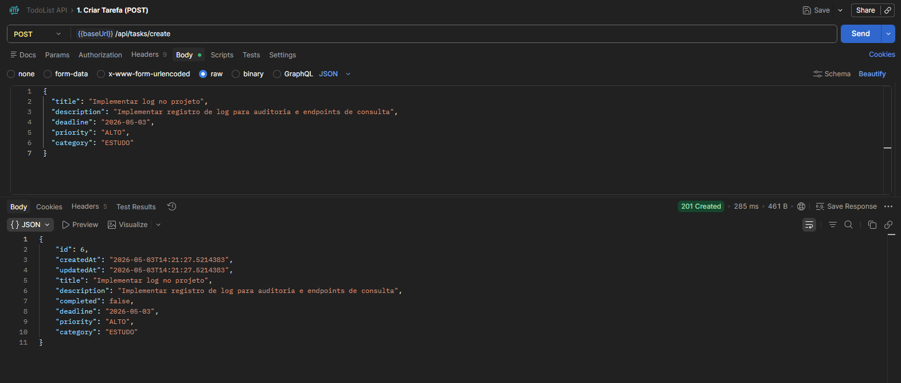
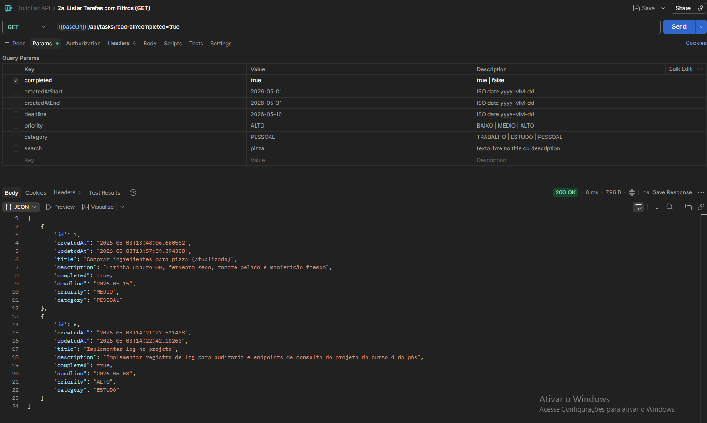
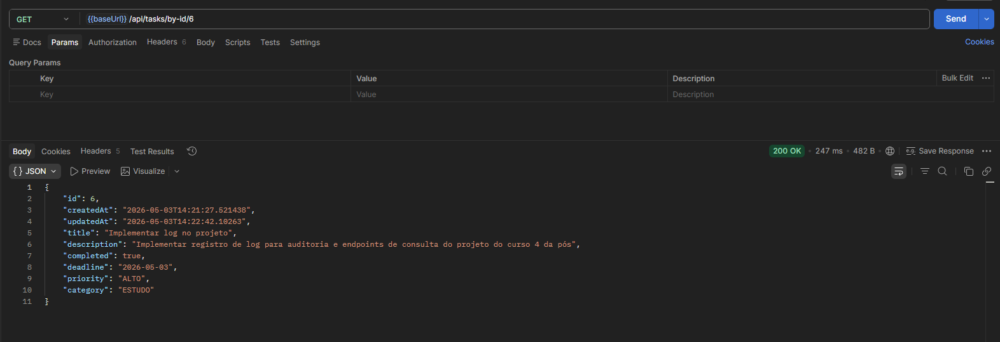
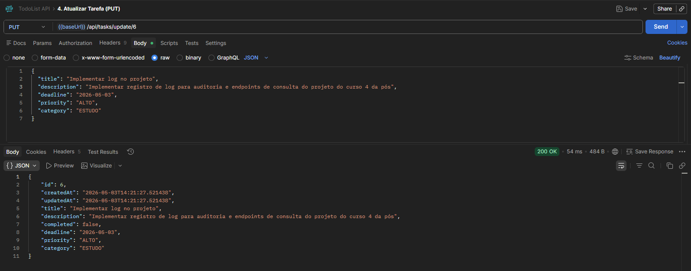
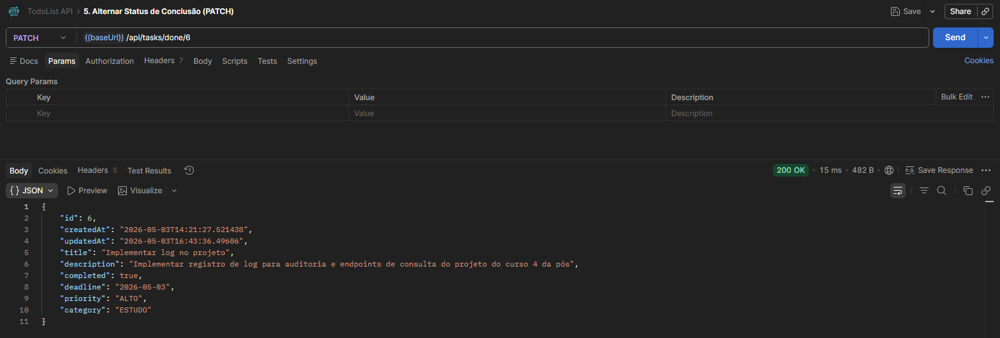
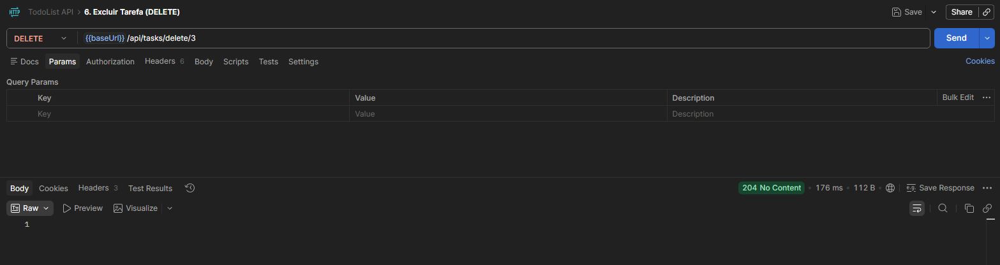
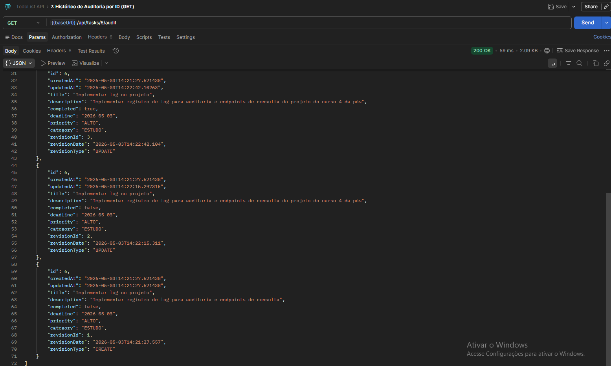
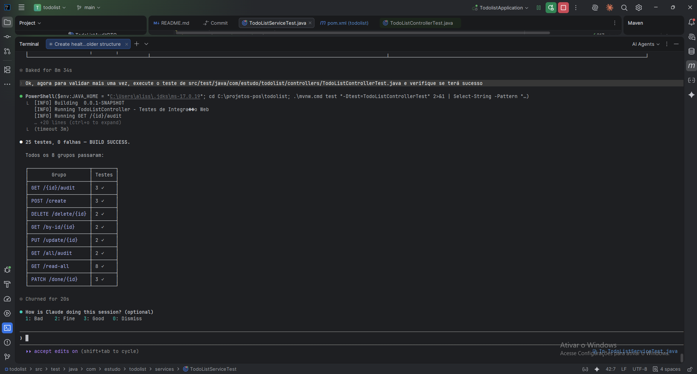
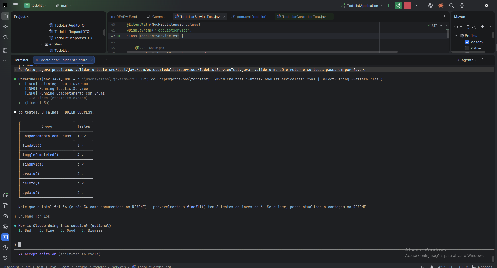

# TodoList API

API RESTful para gerenciamento de tarefas desenvolvida como projeto de **Engenharia de Software com Inteligência Artificial Generativa**. Permite criar, listar, atualizar, excluir e auditar tarefas com suporte a filtros dinâmicos e trilha de auditoria completa.

---

## Índice

- [Tecnologias](#tecnologias)
- [Pré-requisitos](#pré-requisitos)
- [Instalação](#instalação)
- [Execução](#execução)
- [Estrutura do Projeto](#estrutura-do-projeto)
- [Arquitetura](#arquitetura)
- [Endpoints](#endpoints)
- [Filtros de Listagem](#filtros-de-listagem)
- [Auditoria](#auditoria)
- [Testes](#testes)
- [Demo e Validação](#demo-e-validação)
- [Collection Postman](#collection-postman)
- [Limitações Conhecidas](#limitações-conhecidas)
- [Próximos Passos](#próximos-passos)

---

## Tecnologias

| Tecnologia              | Versão        | Papel                                     |
|-------------------------|---------------|-------------------------------------------|
| Java                    | 17            | Linguagem principal                       |
| Spring Boot             | 4.0.6         | Framework base (web, JPA, testes)         |
| Spring Data JPA         | (via Boot)    | Abstração de persistência e Specifications|
| Hibernate ORM           | 7.2.12.Final  | Implementação JPA                         |
| Hibernate Envers        | (via ORM)     | Trilha de auditoria automática            |
| PostgreSQL              | 9.6.24 ¹      | Banco de dados relacional                 |
| Lombok                  | (via Boot)    | Redução de boilerplate na entidade        |
| JUnit 5 + Mockito       | (via Boot)    | Testes de unidade e integração web        |
| Maven                   | 3.x           | Build e gerenciamento de dependências     |

> ¹ Versão em uso no ambiente de desenvolvimento: **PostgreSQL 9.6.24** (Debian 9.6.24-1.pgdg110+1, 64-bit). A aplicação opera nessa versão via workaround de compatibilidade, porém a versão mínima **recomendada** pelo Hibernate 7 é a **13**. Veja [Limitações Conhecidas](#limitações-conhecidas).

---

## Pré-requisitos

- **JDK 17** ou superior instalado e configurado no `PATH`
- **Maven 3.6+** instalado
- **PostgreSQL** em execução (local ou remoto)
- Banco de dados `todolist` criado no PostgreSQL

```sql
CREATE DATABASE todolist;
```

---

## Instalação

**1. Clone o repositório**

```bash
git clone <url-do-repositorio>
cd todolist
```

**2. Verifique as configurações do banco**

As credenciais estão no perfil Maven `desenv` dentro do `pom.xml`:

```xml
<profile>
  <id>desenv</id>
  <properties>
    <spring.datasource.url>jdbc:postgresql://localhost:5432/todolist</spring.datasource.url>
    <spring.datasource.username>seu_username</spring.datasource.username>
    <spring.datasource.password>seu_password</spring.datasource.password>
    <server.port>8030</server.port>
    <server.context>todolist</server.context>
  </properties>
</profile>
```

Edite diretamente no `pom.xml` caso suas credenciais sejam diferentes.

**3. Compile o projeto**

```bash
mvn clean package -P desenv -DskipTests
```

---

## Execução

**Iniciar via Maven (com hot-reload do DevTools)**

```bash
mvn spring-boot:run -P desenv
```

**Iniciar via JAR gerado**

```bash
java -jar target/todolist-0.0.1-SNAPSHOT.jar
```

A aplicação estará disponível em:

```
http://localhost:8030/todolist
```

**Verificar se está no ar**

```
GET http://localhost:8030/todolist/health
```

Resposta esperada:

```json
{
  "status": "UP",
  "version": "0.0.1-SNAPSHOT"
}
```

> O Hibernate cria e atualiza as tabelas automaticamente (`ddl-auto=update`). Na **primeira execução** serão criadas as tabelas `todolist`, `todolist_audit` e `revinfo`.

---

## Estrutura do Projeto

```
todolist/
├── src/
│   ├── main/
│   │   ├── java/com/estudo/todolist/
│   │   │   ├── TodolistApplication.java        # Ponto de entrada + @EnableJpaAuditing
│   │   │   ├── controllers/
│   │   │   │   ├── HealthCheckController.java  # GET /health
│   │   │   │   └── TodoListController.java     # Endpoints CRUD e auditoria
│   │   │   ├── dtos/
│   │   │   │   ├── TodoListRequestDTO.java     # Record — entrada (create/update)
│   │   │   │   ├── TodoListResponseDTO.java    # Record — saída dos endpoints CRUD
│   │   │   │   └── TodoListAuditDTO.java       # Record — saída dos endpoints de auditoria
│   │   │   ├── entities/
│   │   │   │   └── TodoList.java              # @Entity mapeada para a tabela `todolist`
│   │   │   ├── enums/
│   │   │   │   ├── Priority.java              # BAIXO | MEDIO | ALTO
│   │   │   │   └── Category.java              # TRABALHO | ESTUDO | PESSOAL
│   │   │   ├── repositories/
│   │   │   │   └── TodoListRepository.java    # JpaRepository + JpaSpecificationExecutor
│   │   │   └── services/
│   │   │       ├── TodoListService.java       # Lógica CRUD com filtros via Specification
│   │   │       └── TodoListAuditService.java  # Consulta ao histórico via Envers
│   │   └── resources/
│   │       └── application.properties
│   └── test/
│       └── java/com/estudo/todolist/
│           ├── controllers/
│           │   └── TodoListControllerTest.java # @WebMvcTest — 25 testes de integração web
│           └── services/
│               └── TodoListServiceTest.java    # @ExtendWith(Mockito) — 36 testes de unidade
├── todolist.postman_collection.json            # Collection importável no Postman
└── pom.xml
```

---

## Arquitetura

A aplicação segue a arquitetura em camadas padrão do Spring Boot:

```
Cliente HTTP
     │
     ▼
┌──────────────────────┐
│     Controller       │  Recebe a requisição, delega ao service, devolve ResponseEntity
└──────────┬───────────┘
           │
           ▼
┌──────────────────────┐
│       Service        │  Lógica de negócio, construção de Specifications, tratamento de 404
└──────────┬───────────┘
           │
           ▼
┌──────────────────────┐
│     Repository       │  JpaRepository + JpaSpecificationExecutor (filtros dinâmicos)
└──────────┬───────────┘
           │
           ▼
┌──────────────────────┐
│  PostgreSQL           │  Tabelas: todolist · todolist_audit · revinfo
└──────────────────────┘
```

**Decisões de design relevantes:**

- **DTOs como Java 17 Records** — imutáveis e sem boilerplate; `TodoListResponseDTO` inclui método estático `from(entity)` para conversão.
- **Filtros via JPA Specification** — filtros opcionais combinados por `AND` sem proliferar métodos no repository.
- **Spring Data Auditing** — `@CreatedDate` e `@LastModifiedDate` preenchidos automaticamente; nenhuma atribuição manual de timestamps.
- **Hibernate Envers** — `@Audited` na entidade gera automaticamente a tabela `todolist_audit`; `store_data_at_delete=true` preserva o último estado em deleções.
- **Geração de ID por Sequence** — `GenerationType.SEQUENCE` para compatibilidade com PostgreSQL 9.6 (a sintaxe `GENERATED AS IDENTITY` só está disponível a partir do PostgreSQL 10).

---

## Endpoints

**Base URL:** `http://localhost:8030/todolist`

### Health Check

| Método | Endpoint  | Descrição                         | Status de sucesso |
|--------|-----------|-----------------------------------|-------------------|
| GET    | `/health` | Status e versão da aplicação      | `200 OK`          |

### Tarefas

| Método | Endpoint                     | Descrição                                  | Status de sucesso |
|--------|------------------------------|--------------------------------------------|-------------------|
| POST   | `/api/tasks/create`          | Cria uma nova tarefa                       | `201 Created`     |
| GET    | `/api/tasks/read-all`        | Lista tarefas com filtros opcionais        | `200 OK`          |
| GET    | `/api/tasks/by-id/{id}`      | Busca tarefa por ID                        | `200 OK`          |
| PUT    | `/api/tasks/update/{id}`     | Atualiza todos os campos editáveis         | `200 OK`          |
| PATCH  | `/api/tasks/done/{id}`       | Alterna o status `completed` (true/false)  | `200 OK`          |
| DELETE | `/api/tasks/delete/{id}`     | Remove a tarefa permanentemente            | `204 No Content`  |

### Auditoria

| Método | Endpoint                     | Descrição                                          | Status de sucesso |
|--------|------------------------------|----------------------------------------------------|-------------------|
| GET    | `/api/tasks/{id}/audit`      | Histórico de revisões de uma tarefa (mais recente) | `200 OK`          |
| GET    | `/api/tasks/all/audit`       | Todas as revisões de todas as tarefas              | `200 OK`          |

**Respostas de erro padronizadas:**

| Status            | Quando ocorre                                              |
|-------------------|------------------------------------------------------------|
| `404 Not Found`   | ID não encontrado em `by-id`, `update`, `done` e `delete` |

---

### Corpo das requisições

**POST `/api/tasks/create`** e **PUT `/api/tasks/update/{id}`**

```json
{
  "title": "Comprar ingredientes para pizza",
  "description": "Farinha Caputo 00, fermento seco e tomate pelado",
  "deadline": "2026-05-10",
  "priority": "ALTO",
  "category": "PESSOAL"
}
```

| Campo         | Tipo     | Obrigatório | Valores aceitos                    |
|---------------|----------|-------------|------------------------------------|
| `title`       | String   | Sim         | Máximo 100 caracteres              |
| `description` | String   | Não         | Texto livre (sem limite)           |
| `deadline`    | LocalDate| Não         | Formato ISO: `yyyy-MM-dd`          |
| `priority`    | Enum     | Sim         | `BAIXO` \| `MEDIO` \| `ALTO`      |
| `category`    | Enum     | Sim         | `TRABALHO` \| `ESTUDO` \| `PESSOAL` |

> Os campos `id`, `createdAt`, `updatedAt` e `completed` são gerenciados pelo sistema e **não devem ser enviados no corpo da requisição**.

---

## Filtros de Listagem

Todos os parâmetros de `GET /api/tasks/read-all` são **opcionais** e combinados por `AND`:

| Parâmetro      | Tipo     | Exemplo                  | Descrição                                            |
|----------------|----------|--------------------------|------------------------------------------------------|
| `completed`    | Boolean  | `?completed=false`       | Filtra por status de conclusão                       |
| `createdAtStart`| LocalDate| `?createdAtStart=2026-05-01` | Início do intervalo de criação (inclusivo)       |
| `createdAtEnd` | LocalDate| `?createdAtEnd=2026-05-31`   | Fim do intervalo de criação (inclusivo, 23:59:59)|
| `deadline`     | LocalDate| `?deadline=2026-06-01`   | Data-limite exata                                    |
| `priority`     | Enum     | `?priority=ALTO`         | `BAIXO`, `MEDIO` ou `ALTO`                           |
| `category`     | Enum     | `?category=TRABALHO`     | `TRABALHO`, `ESTUDO` ou `PESSOAL`                    |
| `search`       | String   | `?search=pizza`          | Busca parcial (case-insensitive) no título ou descrição |

**Exemplo combinado:**

```
GET /api/tasks/read-all?completed=false&priority=ALTO&category=TRABALHO&search=reunião
```

---

## Auditoria

A trilha de auditoria é implementada com **Hibernate Envers** e registra automaticamente cada operação de `INSERT`, `UPDATE` e `DELETE` na tabela `todolist_audit`.

**Tabelas criadas pelo Envers:**

| Tabela            | Conteúdo                                              |
|-------------------|-------------------------------------------------------|
| `todolist_audit`  | Snapshot da tarefa em cada revisão + `rev` e `revtype`|
| `revinfo`         | Metadados da revisão: número sequencial e timestamp   |

**Exemplo de resposta de auditoria:**

```json
[
  {
    "id": 1,
    "title": "Comprar ingredientes para pizza (atualizado)",
    "completed": true,
    "priority": "MEDIO",
    "category": "PESSOAL",
    "revisionId": 3,
    "revisionDate": "2026-05-03T14:10:00",
    "revisionType": "UPDATE"
  },
  {
    "id": 1,
    "title": "Comprar ingredientes para pizza",
    "completed": false,
    "priority": "ALTO",
    "category": "PESSOAL",
    "revisionId": 1,
    "revisionDate": "2026-05-03T13:42:37",
    "revisionType": "CREATE"
  }
]
```

| `revisionType` | Operação realizada |
|----------------|--------------------|
| `CREATE`       | Tarefa inserida    |
| `UPDATE`       | Tarefa alterada    |
| `DELETE`       | Tarefa removida    |

> Com `store_data_at_delete=true`, revisões do tipo `DELETE` preservam o último estado completo da tarefa.

---

## Testes

O projeto possui dois níveis de teste, totalizando **61 testes**.

### Executar todos os testes

```bash
mvn test -P desenv
```

### Testes de Unidade — `TodoListServiceTest`

Localização: `src/test/java/com/estudo/todolist/services/TodoListServiceTest.java`

- **36 testes** cobrindo todos os caminhos da camada de serviço
- Utiliza `@ExtendWith(MockitoExtension.class)` — sem contexto Spring, execução rápida
- Repository mockado com `@Mock`; service instanciado com `@InjectMocks`
- Asserções com **AssertJ** (`assertThat`)
- `ArgumentCaptor` para inspecionar os dados enviados ao `repository.save()`

| Grupo                  | Testes |
|------------------------|--------|
| `create()`             | 4      |
| `findAll()`            | 8      |
| `findById()`           | 3      |
| `update()`             | 4      |
| `toggleCompleted()`    | 4      |
| `delete()`             | 3      |
| Comportamento de Enums | 10     |

### Testes de Integração Web — `TodoListControllerTest`

Localização: `src/test/java/com/estudo/todolist/controllers/TodoListControllerTest.java`

- **25 testes** validando o protocolo HTTP da camada web
- Utiliza `@WebMvcTest(TodoListController.class)` — carrega apenas a fatia MVC, sem banco
- Serviços mockados com `@MockitoBean`
- Requisições via **MockMvc**; asserções de JSON com **jsonPath**
- Padrão **Given-When-Then** em cada teste

| Endpoint testado        | Testes | Status codes cobertos        |
|-------------------------|--------|------------------------------|
| `POST /create`          | 3      | 201                          |
| `GET /read-all`         | 8      | 200 (lista, vazia, filtros)  |
| `GET /by-id/{id}`       | 2      | 200, 404                     |
| `PUT /update/{id}`      | 2      | 200, 404                     |
| `PATCH /done/{id}`      | 3      | 200, 404                     |
| `DELETE /delete/{id}`   | 2      | 204, 404                     |
| `GET /{id}/audit`       | 3      | 200 (com dados, vazio)       |
| `GET /all/audit`        | 2      | 200 (com dados, vazio)       |

---

## Demo e Validação

### Endpoints

#### `POST /api/tasks/create` — Criação de tarefa



#### `GET /api/tasks/read-all` — Listagem com filtros



#### `GET /api/tasks/by-id/{id}` — Busca por ID



#### `PUT /api/tasks/update/{id}` — Atualização de tarefa



#### `PATCH /api/tasks/done/{id}` — Alternar status de conclusão



#### `DELETE /api/tasks/delete/{id}` — Exclusão de tarefa



#### `GET /api/tasks/{id}/audit` — Histórico de auditoria por ID



---

### Testes automatizados

#### `TodoListControllerTest` — 25 testes de integração web



#### `TodoListServiceTest` — 36 testes de unidade



---

## Collection Postman

O arquivo `todolist.postman_collection.json` na raiz do projeto contém **8 requisições** prontas para uso.

**Como importar:**

1. Abra o Postman
2. Clique em **Import** (canto superior esquerdo)
3. Selecione o arquivo `todolist.postman_collection.json`
4. A collection `TodoList API` aparecerá na barra lateral

**Variável de ambiente pré-configurada:**

| Variável   | Valor padrão                    |
|------------|---------------------------------|
| `baseUrl`  | `http://localhost:8030/todolist` |

**Requisições incluídas:**

| #  | Nome                                  | Método | Endpoint                          |
|----|---------------------------------------|--------|-----------------------------------|
| 1  | Criar Tarefa                          | POST   | `/api/tasks/create`               |
| 2  | Listar Todas as Tarefas               | GET    | `/api/tasks/read-all`             |
| 2a | Listar Tarefas com Filtros            | GET    | `/api/tasks/read-all?...`         |
| 3  | Buscar Tarefa por ID                  | GET    | `/api/tasks/by-id/1`              |
| 4  | Atualizar Tarefa                      | PUT    | `/api/tasks/update/1`             |
| 5  | Alternar Status de Conclusão          | PATCH  | `/api/tasks/done/1`               |
| 6  | Excluir Tarefa                        | DELETE | `/api/tasks/delete/1`             |
| 7  | Histórico de Auditoria por ID         | GET    | `/api/tasks/1/audit`              |
| 8  | Todas as Revisões de Auditoria        | GET    | `/api/tasks/all/audit`            |

> A requisição **2a** possui os parâmetros de filtro desabilitados por padrão; habilite individualmente conforme a necessidade do teste.

---

## Limitações Conhecidas

| Limitação                          | Detalhe                                                                                                                                       |
|------------------------------------|-----------------------------------------------------------------------------------------------------------------------------------------------|
| **PostgreSQL 9.6.24**              | Versão em uso no ambiente de desenvolvimento. O Hibernate 7 emite aviso de versão não suportada (`HHH000511`) pois o mínimo recomendado é 13. Workaround aplicado: `GenerationType.SEQUENCE` no lugar de `GENERATED AS IDENTITY` (disponível apenas a partir do PostgreSQL 10). Recomenda-se migrar para PostgreSQL 13+. |
| **Sem validação de entrada**       | Campos obrigatórios como `title`, `priority` e `category` não possuem validação via Bean Validation (`@NotBlank`, `@NotNull`). Dados inválidos resultam em erro de banco. |
| **Sem paginação**                  | `GET /api/tasks/read-all` retorna todos os registros em uma única resposta, sem suporte a `page` e `size`.                                    |
| **Sem autenticação**               | Todos os endpoints são públicos. Não há controle de acesso ou identificação de usuário.                                                       |
| **Sem documentação OpenAPI**       | Não há Swagger UI integrado para exploração interativa dos endpoints.                                                                         |
| **Versão SNAPSHOT**                | `0.0.1-SNAPSHOT` — não apto para implantação em produção.                                                                                    |

---

## Próximos Passos

- [ ] **Validação de entrada** — adicionar `spring-boot-starter-validation` com anotações `@NotBlank`, `@NotNull` e `@Size` nos DTOs
- [ ] **Paginação e ordenação** — implementar `Pageable` no endpoint `/read-all` via `PagingAndSortingRepository`
- [ ] **Autenticação e autorização** — integrar Spring Security com JWT para proteger os endpoints
- [ ] **Atualizar PostgreSQL** — migrar para a versão 13+ para suporte completo ao Hibernate 7 e remoção do aviso de compatibilidade
- [ ] **Documentação OpenAPI** — adicionar `springdoc-openapi` para geração automática de Swagger UI
- [ ] **Containerização** — criar `Dockerfile` e `docker-compose.yml` com serviços `app` e `postgres`
- [ ] **Testes de integração com banco** — adicionar testes com `@DataJpaTest` e banco H2 ou Testcontainers para validar queries e Specifications
- [ ] **Pipeline CI/CD** — configurar GitHub Actions para executar `mvn test` e `mvn package` a cada push

---

## Uso da IA durante o desenvolvimento

Todo o código deste projeto foi gerado com o auxílio do **Claude Sonnet 4.6** (Anthropic), acessado via **Claude Code** — a CLI oficial da Anthropic — diretamente no terminal integrado ao IDE.

### Estrutura dos prompts utilizados

Todos os prompts seguiram uma estrutura consistente de cinco elementos:

1. **Papel da IA** — definição explícita do perfil esperado (ex.: "Você é um especialista em Java 17 com Spring e JPA..."), orientando o modelo a adotar o nível técnico adequado.
2. **Contextualização** — descrição do projeto, tecnologias envolvidas e estado atual do código, para que a IA não precisasse assumir premissas.
3. **Objetivo** — tarefa a ser executada com exemplos concretos (nomes de endpoints, contratos HTTP, estrutura de pastas).
4. **Resultado esperado** — comportamento final desejado, validação esperada e fluxo de dados.
5. **Observações** — restrições, regras de negócio e instrução explícita para perguntar caso houvesse dúvidas, em vez de supor.

### Exemplo de prompt utilizado

O prompt a seguir foi utilizado para gerar toda a camada de endpoints CRUD, DTOs, service e collection Postman:

---

> **Você é um especialista em java 17**, utilizando spring com jpa API RESTfull e banco de dados postgresql, deverá realizar a seguinte tarefa a seguir:
>
> **Contexto:** Estamos criando uma API RESTful simples que permite criar, ler, atualizar e excluir tarefas feita no projeto de Engenharia de software com inteligência artificial generativa, este projeto irá utilizar java 17, springboot com jpa e banco postgresql.
>
> **Objetivo:** Dentro do projeto `C:\projetos-pos\todolist`, seguindo as boas práticas do jpa e persistência em banco e recursos do spring e as tecnologias do java 17, você deverá criar um DTO para a entidade/classe/tabela `src/main/java/com/estudo/todolist/entities/TodoList.java` (se necessário utilize o record do java 17), e deverá criar um controller para os endpoints que serão criados a seguir, também deverá criar uma classe de service para gerenciar toda a lógica antes de persistir em banco, os endpoints a serem criados são:
>
> 1. **Criar Tarefa (Create)** — `POST /api/tasks/create` — corpo com título, descrição, data de entrega, prioridade e categoria — resposta `201 Created`.
> 2. **Listar Todas as Tarefas (Read)** — `GET /api/tasks/read-all` — filtros opcionais: status de conclusão, intervalo de data de criação, data de entrega, prioridade, categoria e busca por texto no título ou descrição.
> 3. **Buscar Tarefa por ID (Read)** — `GET /api/tasks/by-id/{id}` — `200 OK` se encontrar, `404 Not Found` se não.
> 4. **Atualizar Tarefa (Update)** — `PUT /api/tasks/update/{id}` — substitui todos os dados editáveis.
> 5. **Alternar Status de Conclusão (Partial Update)** — `PATCH /api/tasks/done/{id}` — marca/desmarca como concluída.
> 6. **Excluir Tarefa (Delete)** — `DELETE /api/tasks/delete/{id}` — resposta `204 No Content`.
>
> Todos os códigos de retorno devem ser estruturados e claros seguindo as boas práticas de API. Crie uma collection de todos os endpoints com dados de exemplos para que eu possa copiar e colar no Postman para testar.
>
> **Resultado esperado:** todos os endpoints funcionando corretamente, onde o fluxo é — chamar o endpoint, comunicar com o service e persistir a informação em banco ou retornar a informação conforme o filtro aplicado. Caso as pastas/estruturas para o novo controller e service não existam você deve criar.
>
> **Observações:** Caso tenha alguma dúvida, não suponha o que deve ser feito — pergunte.

---

### Correções assistidas pela IA

Além da geração de código, a IA foi utilizada para diagnosticar e corrigir dois problemas identificados durante a execução dos testes:

1. **Erro no fluxo de criação de tarefa** — após a troca dos valores dos enums (`Priority` e `Category`) para português, o banco rejeitava inserções com violação de constraint CHECK. A IA identificou que o `ddl-auto=update` não recria constraints existentes e orientou a solução (recriar a tabela em ambiente de desenvolvimento).

2. **`TodoListControllerTest` não executava** — a suíte de testes do controller falhava ao iniciar por quatro incompatibilidades com o Spring Boot 4.0: o `JAVA_HOME` local apontava para Java 8; `@WebMvcTest`, `@MockBean` e `ObjectMapper` pertenciam a pacotes renomeados ou removidos nessa versão; e `@EnableJpaAuditing` na classe principal causava falha no contexto do slice de testes. A IA mapeou todas as mudanças e aplicou as correções necessárias.

---

*Projeto acadêmico UFG — Engenharia de Software com Inteligência Artificial Generativa*
